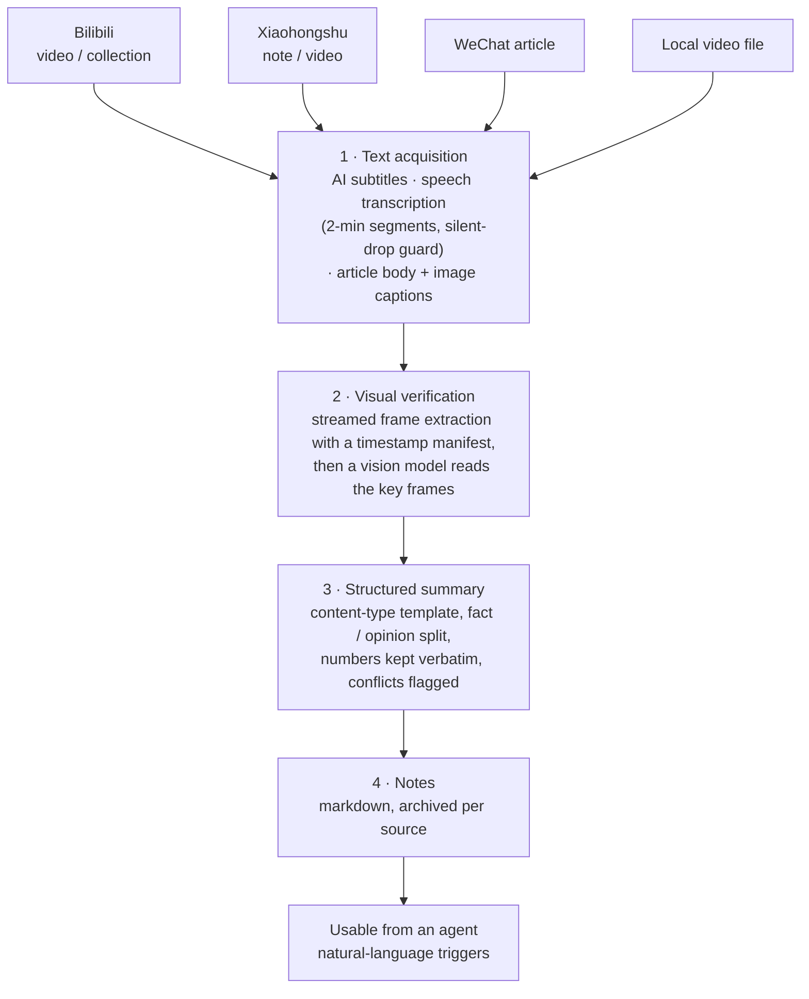

# video-digest-skill — Video Parsing & Notes

> **Stop re-watching videos to remember them.** video-digest turns Bilibili videos, Xiaohongshu (RED) notes/videos, WeChat public-account articles, and local recordings into structured, verified notes — pulling subtitles or transcribing speech, checking key visuals with vision models, extracting text from images (with per-image captions, so figures become searchable content), and separating hard facts from opinions. Bring your own models: DeepSeek for vision, MiMo for speech by default — swapping models is config-only (no code changes within 3 supported protocols), with automatic fallback when the primary channel fails.

[English](README.md) | [简体中文](README.zh-CN.md)

## Highlights

- **Multi-source input**: Bilibili AI subtitles (second-precision), Xiaohongshu notes/videos (auto type-detect), WeChat articles (text + image captioning), or any local video file
- **Multimodal pipeline**: speech transcription + frame-level vision verification + image-text extraction & captioning
- **Fact/opinion split**: structured summaries that keep claims verifiable
- **Bring your own model**: DeepSeek for vision + MiMo for speech by default; within the three supported protocols (Anthropic messages / OpenAI chat / transcription) swapping is **config-only**, with an automatic fallback chain
- **Zero credentials in repo**: keys live in environment variables only
- **Tested integrations**: Claude Code and Codex Desktop (skill discovery + package layout validated 2026-08-29; end-to-end provider execution pending). Core pipeline is Python CLI-based and can be adapted to other agents that can load Markdown skill instructions and execute local commands. Other agent integrations have not yet been validated.

> Personal-use tool, open-sourced. Built on DeepSeek (vision verification + summarization) and Xiaomi MiMo (speech transcription) — all swappable via config.

## Capabilities

| Capability | Script | Notes |
|------------|--------|-------|
| Bilibili subtitle fetch | `scripts/bili_subtitle.py` | AI subtitles, second-precision (requires login) |
| Speech transcription | `scripts/asr.py` (codec: `llm_codec.py`) | wav/mp3 → text (MiMo by default, swappable, auto-fallback) |
| Vision verification | `scripts/vision.py` (codec: `llm_codec.py`) | image/frame → visual understanding (DeepSeek by default, MiMo as fallback) |
| Structured summary | `scripts/bili_summarize.py` | fact/opinion dual-track template; content-type templates (7: stock/news/teaching/tech/lecture/wx/general), auto long-text chunking; finance templates add **scope labels** (CSI-only / incl. BSE / whole market), **derived-metric labels** and **conflict trust hints** |
| Local video parsing | `scripts/local_video_pipeline.py` | local video file → transcript → notes (any recorded source); 2-min segments with silent-drop protection |
| Lecture segment merge | `scripts/local_video_merge.py` | stitch multi-file recordings of one lecture into a single overview (defaults to the latest recording session only) |
| Visual-only content | `scripts/visual_palette.py` | for videos whose content IS the visuals (gradient cards, palette demos): frame sampling → freeze detection → keyframe k-means palettes → HSL design rules; `--labels` reads on-screen hex codes and verifies each one |
| Batch tracking | `scripts/digest_daily.py` | Bilibili followed-creator incremental archive (creators via `config/creators.example.json`) |
| **Collection tracking** | `scripts/digest_daily.py` + `season_id` | track only a **specific collection/season**, ignoring the creator's other uploads — for course series from creators who also post unrelated content daily. Three orthogonal admission layers: time (`season_backfill`: `all` / `none` / `since:YYYY-MM-DD` — news collections need `since:` or old episodes flood in), content (`season_filter`: title substring or `regex:`), semantics (`season_llm_filter`: LLM judges whether an episode belongs to the collection's theme, since a collection's boundary isn't the content's boundary) |
| Frame extraction | `scripts/video_frames.py` | streaming frame extraction with timestamp manifest (ffmpeg) |
| Frame vision pipeline | `scripts/video_vision.py` | batch frames → MiMo vision → timestamped visual summary (4 concurrent workers) |
| XHS note/video parsing | `scripts/xhs_note.py` | Xiaohongshu link → type detect (video/image) → download → optional ASR/frames/image-text (web_session in `~/.xhs_web_session`) |
| WeChat article parsing | `scripts/wx_article.py` | mp.weixin.qq.com → text (images become [图N] markers) → image download + MiMo captioning → wx-template summary; idempotent cache |
| Multi-P / long video | `scripts/bili_media.py` | page enumeration (112-P verified) / subtitle-coverage check / ASR fallback for long videos (>20min) |
| Document conversion | `markitdown` (Microsoft OSS, global python311) | PDF/docx/html → markdown, for arXiv papers and other document-type content |

## How it works



Text and visuals are acquired independently and then reconciled: a number spoken in the audio and the same number shown on screen are compared, and a disagreement is marked in the note instead of being silently resolved.

## Install

```bash
git clone https://github.com/coocA-Alex/video-digest-skill.git
# Option 1: user-level
cp -r video-digest-skill ~/.claude/skills/video-digest
# Option 2: project-level
cp -r video-digest-skill <your-project>/.claude/skills/video-digest
```

## Usage

Natural-language triggers: **"parse this video [URL/BV]" / "parse this local video [path]" / "parse this WeChat article [URL]" / "summarize this video" / "make video notes" / "extract subtitles" / "verify frames"**

## Configuration (credential isolation — important)

1. Create `.env` in the project root (gitignored, **never commit**):
   ```
   MIMO_API_KEY=your_mimo_platform_key
   DEEPSEEK_API_KEY=your_deepseek_key
   ```
   Login cookies live **outside the repo** (never committed): Bilibili SESSDATA → `~/.bili_sessdata`; Xiaohongshu web_session → `~/.xhs_web_session`. Scripts read these paths only and never print them.
2. Swappable models: edit the `asr`/`vision` sections of `config/multimodal.json` (provider/protocol/model/base_url/api_key_env/auth/params/limits/fallback). If the protocol is one of Anthropic messages / OpenAI chat / transcription → **config-only change**; a new protocol needs a new codec (see `scripts/llm_codec.py`).
3. **Agent compatibility**: Tested integrations: Claude Code and Codex Desktop. Scripts are plain Python CLI with no agent dependency; key resolution order = environment variable (`api_key_env`) → project-local key file (`api_key_file`, e.g. `config/ds_key.local.json`). **The Claude Code global-config fallback is off by default** — enable it explicitly with `allow_anthropic_token_fallback: true` in the `summarize` section of `multimodal.json`.

## Open-source notice

- **MIT license** (see LICENSE): free to use, copy, modify, distribute (incl. commercial), with attribution retained
- Provided "as is", no warranty, use at your own risk
- **Privacy**: no real credentials in this repo (`.env` gitignored); never commit personal keys
- **Maintenance**: personal-use tool, best-effort maintenance; PRs for fixes welcome, complex features → fork

## Disclaimer

- For **personal learning/research only**: follow Bilibili ToS, no commercial/bulk scraping
- Xiaohongshu: parse single notes on demand only (user-provided links); no signature reverse-engineering, no list/comment harvesting
- Subtitle/frame content belongs to original creators and platforms; summaries for personal reference only
- Cookie-heavy access may trigger account risk control — use at your own risk
- Platform APIs may change and break — normal for this kind of tool

## Directory

```
video-digest-skill/
├── SKILL.md              ← skill definition (frontmatter + workflow)
├── scripts/              ← plain Python CLI (agent-independent)
├── config/
│   ├── multimodal.json   ← model config (no keys)
│   └── creators.example.json
├── requirements.txt
└── LICENSE
```

## Acknowledgements

- [Xiaomi MiMo](https://github.com/XiaomiMiMo) — MiMo multimodal models (ASR + vision) and platform
- [DeepSeek](https://www.deepseek.com/) — summarization model API
- Compliance/open-source doc structure inspired by [bilibili-video-summary](https://github.com/bfftp0502/bilibili-video-summary)

## Contributors

- [coocA-Alex](https://github.com/coocA-Alex) — author
- [DeepSeek](https://www.deepseek.com/) — AI-assisted development (model-driven)

> Development stack: Claude Code as the coding-agent client, DeepSeek models as the LLM backend.
